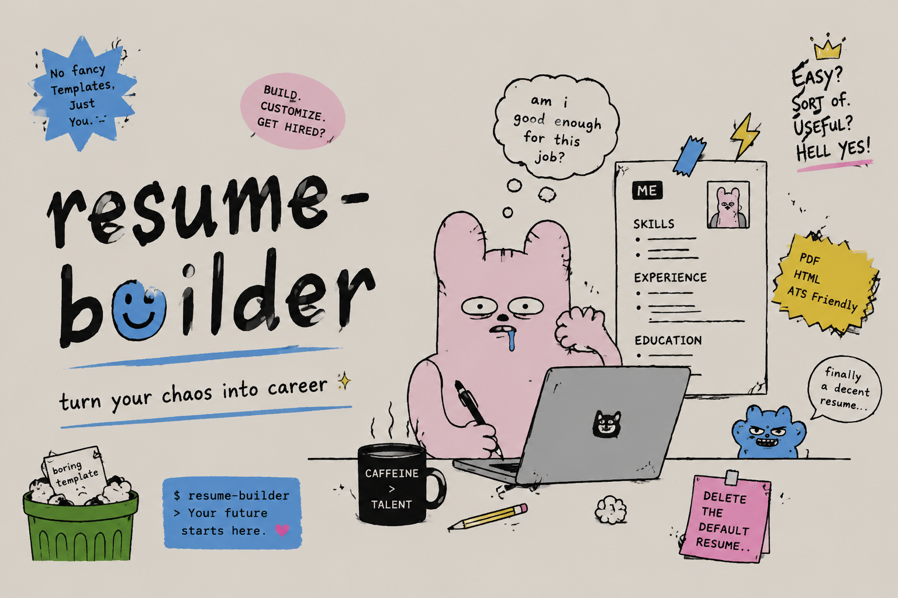
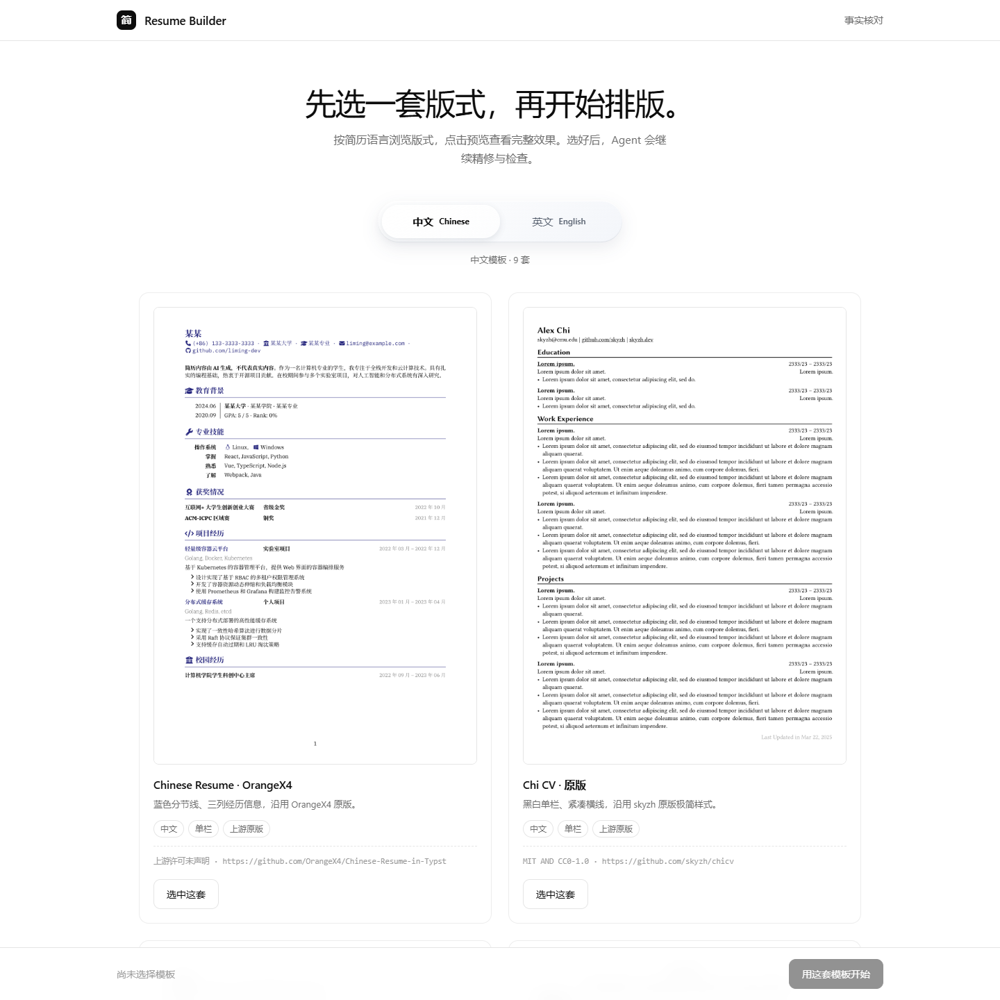
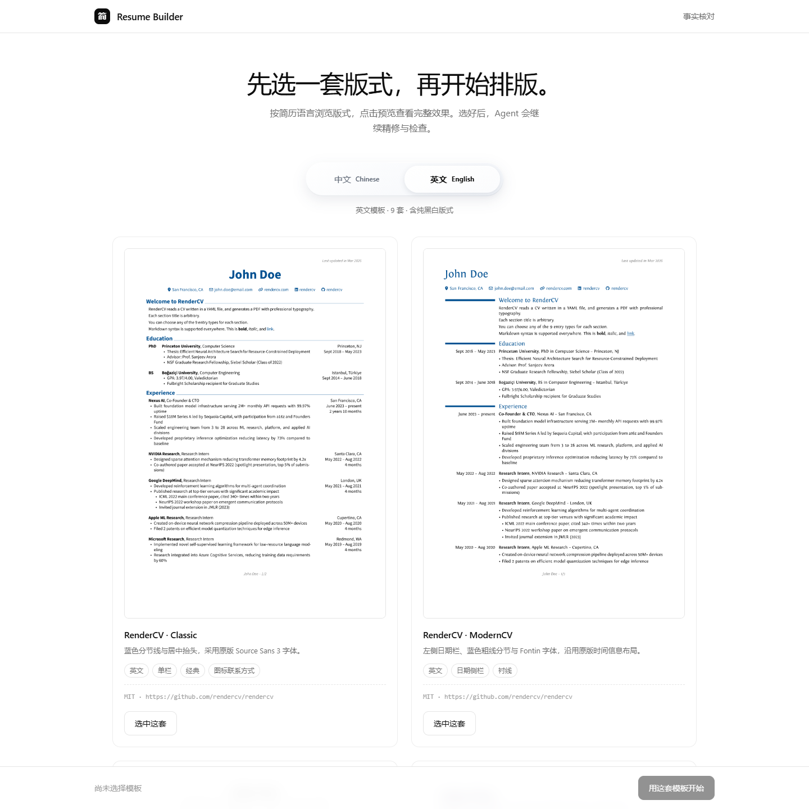
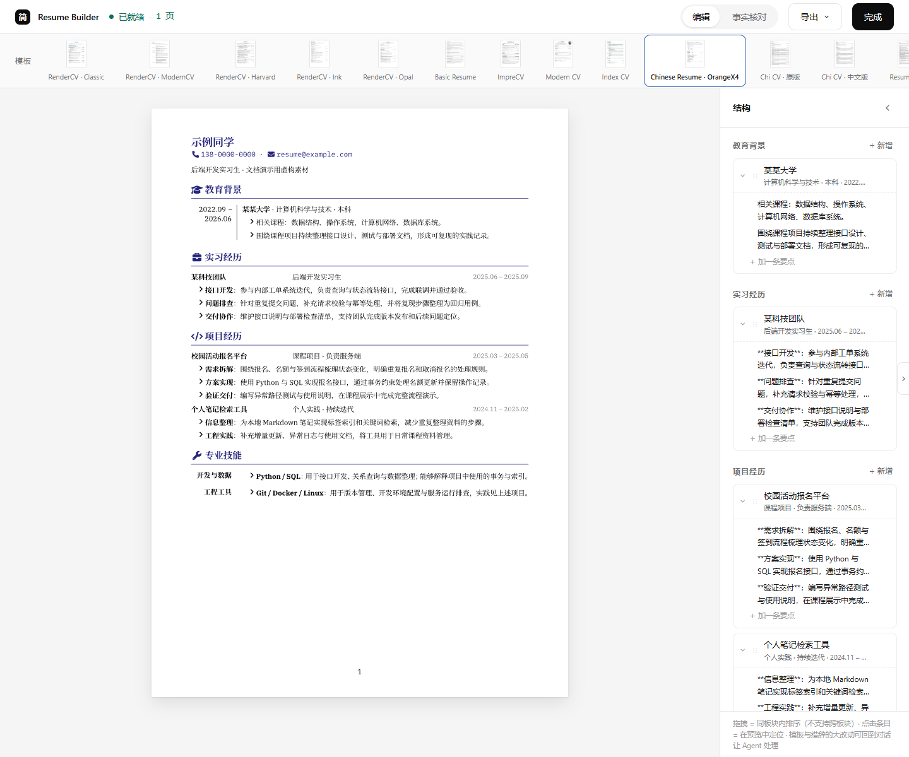
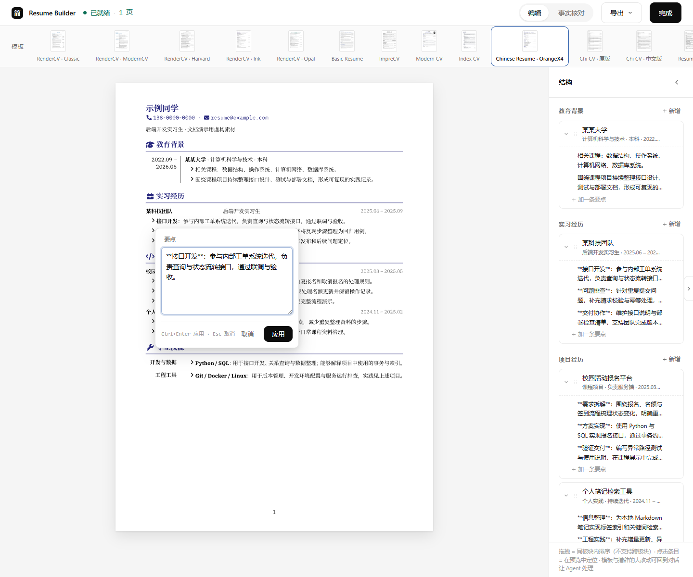
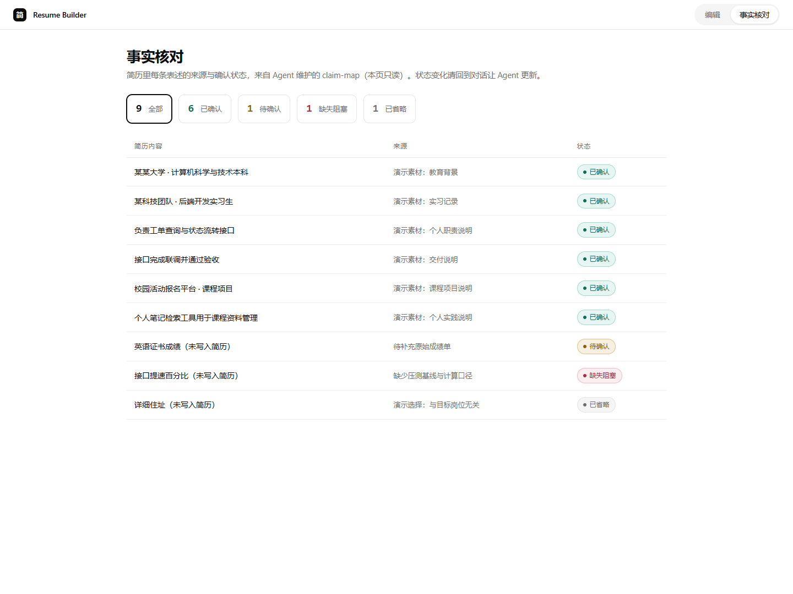
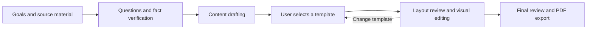

# resume-builder

**An Agent Skill for turning verified experience into application-ready resumes.**

[简体中文](README.md) · English



`resume-builder` brings guided questions, fact verification, resume writing, template selection, and PDF export into one workflow. It supports one- to two-page Chinese or English resumes for jobs, internships, competitions, and academic admissions.

Its writing methodology is **distilled from nearly 100 highly liked resume advice posts on Xiaohongshu (Rednote)** and organized into a guide the Agent must read before drafting. Users provide their goals and available materials; the Agent identifies missing information, asks about individual contributions and supporting evidence, then prepares the resume through a local template gallery and visual editor.

[What's New](#whats-new) · [Features](#features) · [Screenshots](#screenshots) · [Quick Start](#quick-start) · [Installation](INSTALL.md)

<a id="whats-new"></a>

## What's New

- **Chinese and English template gallery:** Nine templates per language, with category switching, full previews, and remembered selections.
- **Visual browser editing:** Click text blocks to edit, add or remove entries and bullets, and reorder items within a section.
- **Typst rendering and live previews:** Automatically render saved changes, display actual page counts, and export consistently named PDFs.
- **Conversation and browser collaboration:** The Agent and editor share `resume.json`, so content work can continue through either interface.
- **Fact review page:** Inspect sources and filter claims by confirmed, pending, blocking, or omitted status.
- **Two-stage drafting:** Write template-independent content first, then refine it for the selected layout. Changing templates triggers another layout review.

<a id="features"></a>

## Features

### Proactive questions that uncover relevant experience

Users do not need a complete draft to get started. The Agent can work from an existing resume, scattered notes, or a conversation. It establishes the target, selects relevant material, and asks questions in prioritized batches, typically three to six at a time.

For example, “contributed to a campus registration system” prompts questions about responsibilities, technical choices, difficulties, actual usage, and deliverables. The Agent updates the evidence record as the user responds and follows up on remaining gaps. Information explicitly marked as unavailable, skipped, or excluded is not repeatedly requested.

Once the material is sufficient, the Agent proceeds to template selection. Users provide facts, confirm content choices, and select a layout; they do not have to orchestrate each step.

### Practical writing guidance from Xiaohongshu

The [complete writing guide](references/Resume-Writing-Guide-LLM.md) covers engineering, AI / Agent projects, data, product and operations, graduates, career changes, and academic admissions. Its core principles are:

- **Select for the target:** Create a resume for a specific goal and prioritize relevant, supported experience.
- **Make individual contributions clear:** Connect the problem, personal actions, and outcome instead of listing responsibilities alone.
- **Prioritize evidence over numbers:** Check how metrics were calculated. When reliable numbers are unavailable, describe deployment, adoption, acceptance, or deliverables.
- **Write claims the candidate can explain:** Do not invent experience, inflate ownership, or present team results as individual achievements.

The guidance is bundled with the project. Using the skill does not require accessing Xiaohongshu or signing in to it. The detailed guide and Agent installation instructions are currently written in Chinese.

### Traceable facts and resumable projects

Each resume has its own claim map and project directory. The Agent uses confirmed facts when drafting. The browser displays claim statuses read-only; editing wording does not automatically verify a claim. The export button does not enforce claim approval, so factual checks remain part of the writing workflow and final review.

Content and session state are stored locally and can be resumed after closing the browser. Concurrent Agent and browser edits use the most recently saved content; conflicts are not automatically merged.

<a id="screenshots"></a>

## Screenshots

These are actual local application screenshots. The editor uses fictional demonstration data; gallery cards show public upstream template previews. See [screenshot provenance](assets/screenshots/README.md). The screenshots show the current Chinese-language interface, which supports both Chinese and English resume content.

### Template gallery

Browse by language and inspect full previews before choosing a template. Switching categories does not change resume content. If a template in another language is selected, the Agent handles translation, refinement, and verification.

| Chinese templates | English templates |
|---|---|
|  |  |

### Visual editor

The preview is rendered by Typst and supports text-block editing, structural changes, template switching, and page-count inspection. Larger content revisions can continue in the Agent conversation.



<details>
<summary>View inline editing and fact review</summary>

**Inline editing:** Click a field in the preview to edit it. Bold text and links are supported, and saved changes trigger a new render.



**Fact review:** Inspect sources and four confirmation statuses. The Agent maintains those statuses through the conversation.



</details>

<a id="quick-start"></a>

## Quick Start

Send the following to an Agent that can access local files, execute commands, and load `SKILL.md`:

```text
Fetch and follow instructions from:
https://raw.githubusercontent.com/StoneLL1/resume-builder/main/INSTALL.md
```

Alternatively, ask the Agent to read [INSTALL.md](INSTALL.md) from a local checkout. The instructions are written for the Agent and cover directory discovery, installation, runtime setup, and verification. Claude Code and Codex use their configured skill directories; OpenClaw, Hermes, and other runners use their own configuration.

After installation, for example:

```text
Use resume-builder to create a one-page English resume for this job description.
I will provide my existing resume and additional experience. Proactively ask for
missing information and verify the facts before drafting. Once the content is
ready, open the template gallery so I can choose a layout and refine it in the browser.
```

Windows and macOS bootstrap scripts prepare Python, Typst, and open fonts. Node.js and XeLaTeX are not required. Some templates need original system fonts; see [installation instructions](INSTALL.md).

## Workflow



Existing resumes, job descriptions, and additional materials are provided through the conversation. The browser opens after content preparation. When editing is complete, use the **完成 (Finish)** button to notify the Agent, then **导出 → 导出正式 PDF (Export → Export final PDF)** after review. Files are named `Name-TargetRole-Phone.pdf`, with the phone portion omitted when unavailable.

## Templates

| Language | Included templates |
|---|---|
| Chinese · 9 | OrangeX4, Chi CV original / Chinese edition, Resume NG, Miku CV, Qianxi, Unique CV, Habaneraa, SweetGargamel. |
| English · 9 | RenderCV Classic / ModernCV / Harvard / Ink / Opal, Basic Resume, ImpreCV, Modern CV, Index CV. |

Templates retain upstream layouts and fonts, with pinned revisions, attribution, and adaptation diffs. Harvard provides a black-and-white layout. See the [template registry](assets/templates/registry.md) for details.

## Project Structure

```text
resume-builder/
├── SKILL.md                       # Agent entry point and workflow routing
├── INSTALL.md                     # Agent-facing installation instructions
├── README.md / README.en.md        # Chinese / English documentation
├── cover.png                      # Original cover artwork
├── references/                    # Writing guide, data contract, and stage guides
├── scripts/                       # Bootstrap, server, rendering, and validation
└── assets/                        # Templates, web UI, dependency manifests, screenshots
```

Each resume is stored in a separate purpose-specific directory outside the skill, containing `resume.json`, the final PDF, and a `work/` directory for source notes, the claim map, session state, and build artifacts.

## Scope and Data Handling

- Supports one- to two-page Chinese or English resumes in desktop browsers. Bootstrap scripts cover Windows and macOS; a Linux runtime manifest is not currently provided.
- The web and rendering service listens only on `127.0.0.1`. Initial setup downloads runtimes and open fonts; templates and Typst packages are bundled.
- Data handling in the Agent conversation depends on the Agent and model provider. A local web interface does not imply that the entire AI workflow runs offline.
- Mixed bilingual layouts, mobile / tablet editing, browser uploads of resumes or job descriptions, embedded AI chat, cross-section dragging, and snapshot rollback are not currently supported.
- Cover letters, portfolios, and long academic CVs are outside the skill's scope.

<a id="licenses"></a>

## Acknowledgments and License

Thanks to the Xiaohongshu contributors who shared their resume experience, and to the maintainers of the upstream templates, Typst, fonts, and icon projects.

Original project code is licensed under [MIT](LICENSE). Third-party assets retain their respective licenses; see the [template registry](assets/templates/registry.md), per-template `ATTRIBUTION.md` files, and [runtime notices](assets/runtime-NOTICES.md). The pinned OrangeX4, Chi CV Chinese edition, and Unique CV sources do not declare a standalone license and are recorded as `NOASSERTION`; the project's MIT license does not cover them.
