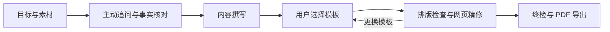

# resume-builder

**从真实经历到可投递简历的 Agent Skill。**

简体中文 · [English](README.en.md)


`resume-builder` 将主动提问、事实核对、内容撰写、模板选择和 PDF 导出整合为一套工作流，适用于中文或英文的 1–2 页求职、实习、比赛与升学简历。

写作方法论**蒸馏自近百篇小红书高赞简历经验帖**，沉淀为 Agent 动笔前必须阅读的写作指南。用户提供已有材料和目标，Agent 主动识别信息缺口、追问个人贡献与成果证据，再通过本地模板画廊和可视化编辑器完成交付。

[What's New](#whats-new) · [核心能力](#features) · [界面预览](#screenshots) · [快速开始](#quick-start) · [安装说明](INSTALL.md)

<a id="whats-new"></a>

## What's New

- **中英文模板画廊**：中文 9 套、英文 9 套，支持分类切换、完整预览与选择记忆。
- **浏览器可视化精修**：点击文字块编辑，增删经历与要点，在同一板块内拖拽排序。
- **Typst 排版与实时预览**：保存后自动重新渲染，显示实际页数，导出规范命名的 PDF。
- **对话与网页协作**：Agent 和编辑器共享 `resume.json`，内容调整可在两种方式之间继续。
- **事实核对页面**：查看表述来源，按已确认、待确认、缺失阻塞、已省略四种状态筛选。
- **两阶段撰写**：先形成与模板无关的内容稿，再针对所选版式精修；换模板后重新检查。

<a id="features"></a>

## 核心能力

### 主动追问，补齐有价值的信息

不要求用户先整理出一份完整简历。Agent 会从旧简历、零散文字或口述经历出发，确认目标，筛选素材，再按优先级分批提问，通常每批 3–6 个问题。

例如，“参与校园报名系统开发”会引出对职责边界、技术选择、实际难点、使用情况和交付物的追问。用户补充后，Agent 更新证据记录，继续处理尚未解决的关键缺口。用户明确表示“没有”“跳过”或“不写”的内容不会被反复追问。

素材充分后，Agent 自行推进到模板选择。用户负责提供事实、确认取舍和选择版式，无需逐步编排整个流程。

### 小红书经验沉淀为写作规则

[完整写作指南](references/Resume-Writing-Guide-LLM.md) 覆盖技术、AI / Agent、数据、产品运营、应届、转行和复试等场景。README 仅概括四项原则：

- **目标决定取舍**：一个目标一份简历，优先展示相关且有证据的经历。
- **突出个人贡献**：写清问题、个人动作与结果，不以职责清单代替成果。
- **证据优先于数字**：有可信指标时核对口径；没有数字时使用上线、采用、验收或交付物等事实。
- **表达经得起追问**：不虚构经历、夸大角色或将团队成果归为个人成果。

这些经验已整理在项目中，使用时无需访问或登录小红书。

### 事实可追溯，项目可继续编辑

每份简历维护独立的事实追溯表和用途目录。Agent 只使用已确认的事实撰写内容；网页只读展示事实状态，修改措辞不会自动确认事实。导出按钮本身不拦截未确认项，真实性由写作流程与终检把关。

内容和会话保存在本地，关闭浏览器后可恢复。Agent 与网页并发编辑时以后保存的内容为准，不自动合并冲突。

<a id="screenshots"></a>

## 界面预览

以下为真实本地界面截图。编辑器使用虚构演示素材；画廊卡片使用上游公开模板预览，来源见 [截图说明](assets/screenshots/README.md)。

### 模板画廊

按中文或英文浏览，点击预览查看完整大图，再由用户选择模板。切换分类不会修改正文；跨语言选定模板后，Agent 负责翻译、精修与核验。

| 中文模板 | 英文模板 |
|---|---|
|  |  |

### 可视化编辑器

预览由 Typst 实际渲染，支持文字块编辑、结构调整、模板切换与页数查看。较大幅度的内容修改仍可在 Agent 对话中完成。


<details>
<summary>查看就地编辑与事实核对</summary>

**文字块编辑**：点击预览中的字段进行修改，支持加粗和链接，保存后自动重新排版。


**事实核对**：查看来源与四种确认状态；状态由 Agent 在对话中维护。


</details>

<a id="quick-start"></a>

## 快速开始

将以下内容发送给能够读写本地文件、执行命令并加载 `SKILL.md` 的 Agent：

```text
Fetch and follow instructions from:
https://raw.githubusercontent.com/StoneLL1/resume-builder/main/INSTALL.md
```

也可以让 Agent 读取本地项目中的 [INSTALL.md](INSTALL.md)。安装说明面向 Agent，包含目录探测、文件部署、依赖准备与验证流程。Claude Code、Codex 可按各自技能目录接入，OpenClaw、Hermes 等使用其实际 runner 配置。

安装后，例如：

```text
请使用 resume-builder，针对这份 JD 帮我制作一页中文简历。
我会提供旧简历和补充经历。请主动追问缺失信息，核对事实后再撰写；
内容充分后打开模板画廊，让我选择版式并在网页中精修。
```

Windows / macOS 提供运行时引导脚本，准备 Python、Typst 和开放字体，无需 Node.js 或 XeLaTeX。部分模板依赖本机原版字体，详见 [安装说明](INSTALL.md)。

## 工作流



旧简历、JD 和补充材料通过对话提供。内容充分后才启动网页。编辑完成后，点击「完成」通知 Agent 终检，再通过「导出 → 导出正式 PDF」生成 `姓名-目标岗位-电话.pdf`；缺少电话时省略该部分。

## 模板

| 分类 | 内置模板 |
|---|---|
| 中文 · 9 套 | OrangeX4、Chi CV 原版 / 中文版、Resume NG、Miku CV、Qianxi、Unique CV、Habaneraa、SweetGargamel。 |
| 英文 · 9 套 | RenderCV Classic / ModernCV / Harvard / Ink / Opal、Basic Resume、ImpreCV、Modern CV、Index CV。 |

沿用上游布局与字体，保留固定版本、来源和适配差异；Harvard 提供纯黑白版式。完整信息见 [模板注册表](assets/templates/registry.md)。

## 项目结构

```text
resume-builder/
├── SKILL.md                       # Agent 入口与阶段路由
├── INSTALL.md                     # Agent 安装流程
├── README.md / README.en.md        # 中文 / 英文介绍
├── cover.png                      # 原始封面
├── references/                    # 写作指南、数据契约与阶段说明
├── scripts/                       # 安装、服务、渲染与校验
└── assets/                        # 模板、网页、依赖清单与截图
```

每个用途另建目录，在 skill 之外保存 `resume.json`、正式 PDF，以及 `work/` 下的素材、事实追溯表、会话状态与构建中间产物。

## 运行范围与数据

- 支持桌面浏览器中的中文或英文单语 1–2 页简历；自动安装脚本覆盖 Windows 与 macOS，当前不提供 Linux 安装清单。
- 网页与排版服务仅监听 `127.0.0.1`。首次安装需要下载运行时与开放字体；模板与 Typst 包随项目提供。
- 与 Agent 对话时的数据处理取决于所用 Agent 和模型服务，不能将本地网页运行等同于整个 AI 工作流离线运行。
- 当前不提供双语混排、手机 / 平板编辑、网页上传旧简历或 JD、内置 AI 聊天、跨板块拖拽或历史快照回滚。
- 求职信、作品集和多页学术 CV 不在范围内。

<a id="licenses"></a>

## 致谢与许可

感谢小红书简历经验分享者，以及开源模板、Typst、字体与图标项目的维护者。

项目原创部分采用 [MIT 许可证](LICENSE)。第三方资产遵循各自许可，详见 [模板注册表](assets/templates/registry.md)、各模板的 `ATTRIBUTION.md` 和 [运行时说明](assets/runtime-NOTICES.md)。OrangeX4、Chi CV 中文版和 Unique CV 的固定上游版本未声明独立许可证，记录为 `NOASSERTION`，不由本项目 MIT 授权覆盖。
